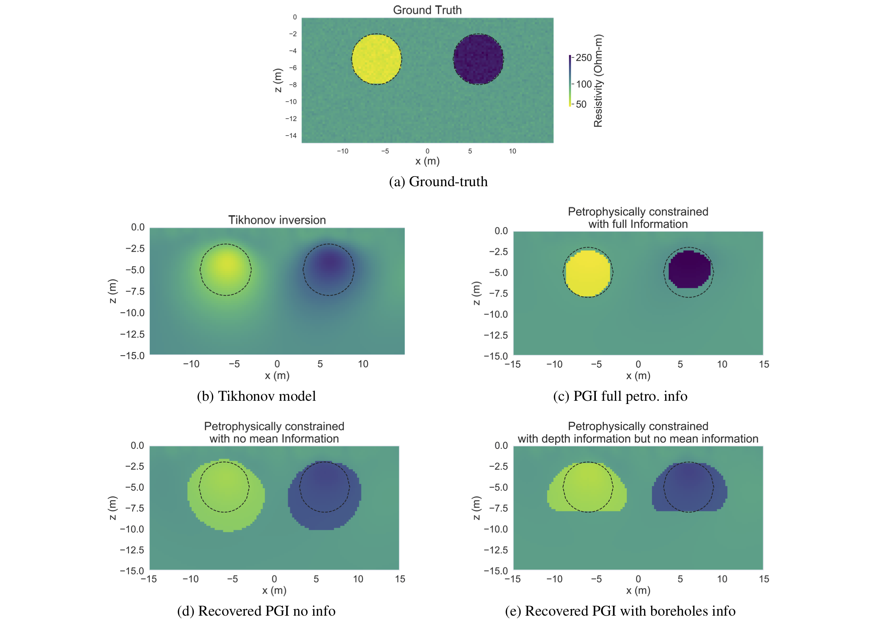

**[summary](#summary) | [contents](#contents) | [usage](#usage) | [running the notebooks](#running-the-notebooks) | [issues](#issues) | [citations](#citations) | [license](#license)**

# Open source software for petrophysically and geologically guided geophysical inversion (PGI) 

[](https://travis-ci.org/simpeg-research/Astic-2019-PGI)
[](https://mybinder.org/v2/gh/simpeg-research/Astic-2019-PGI/master?filepath=index.ipynb)
[](https://notebooks.azure.com/import/gh/simpeg-research/Astic-2019-PGI)
[](https://zenodo.org/badge/latestdoi/169800572)
[](https://github.com/simpeg-research/Astic-2019-PGI/blob/master/LICENSE)
[](http://simpeg.xyz)

Notebooks and python scripts to reproduce the figures shown in Astic & Oldenburg (2019). Implemented as part of the [<tt>`SimPEG`</tt> package](https://simpeg.xyz/).



## Summary

We propose a new framework for incorporating petrophysical and geological information into voxel-based geophysical inversion. By quantitatively linking these data into a single framework, we recover a final inverted model that reproduces the observed, or desired, petrophysical and geological features while fitting the geophysical data. In the hope of facilitating this exploration and promoting reproducibility of geophysical simulations and inversions, we make the scripts of those examples publicly available thanks to the open source software package, SimPEG. This allows researchers to interrogate all of the components and to facilitate the exploration of our new inversion strategies. We highlight different capabilities of our methodology by inverting magnetotelluric and DC resistivity data in 1D and 2D respectively. Finally we apply our framework to inverting airborne over frequency domain data, acquired in Australia, for the detection and characterization of saline contamination of freshwater.

## Contents

There are 3 notebooks in this repository:

- [1_MT_PGI_Sharp_Smooth.ipynb](notebooks/MT/1_MT_PGI_Sharp_Smooth.ipynb)

    - Magnetotelluric data are acquired over a layered-earth that has sharp and smooth features. The PGI algorithm is provided with the true petrophysical distribution and the goal is to use it along with the MT data to find a solution that has the desired contrast features.


- [2_DC_PGI_2cylinders.ipynb](notebooks/DC/2_DC_PGI_2cylinders.ipynb)

    - A DC resistivity profile is acquired over two cylinders. We illustrate the performance of this framework when no physical property mean values are available, and compared it to the result with full petrophysical information. We highlight then how geological information from borehole logs can be incorporated into this framework.


- [3_FDEM_PGI_Bookpurnong.ipynb](notebooks/FDEM/3_FDEM_PGI_Bookpurnong.ipynb)

    - This example illustrates an application of the PGI approach on a field frequency-domain EM dataset, in conjunction with a structurally constraining regularization, without using extensive geological or petrophysical information. We demonstrate how to use this framework to test hypothesis, such as a recovering a specific number of distinct units, and to build confidence, or doubts, in geological features displayed by the inversions.


## Usage

Dependencies are specified in [requirements.txt](/requirements.txt)

```
pip install -r requirements.txt
```

To run the notebooks locally, you will need to have python installed,
preferably through [anaconda](https://www.anaconda.com/download/) .

You can then clone this repository. From a command line, run

```
git clone https://github.com/simpeg-research/Astic-2019-PGI.git
```

Then `cd` into the `Astic-2019-PGI` directory:

```
cd Astic-2019-PGI
```

To setup your software environment, we recommend you use the provided conda environment

```
conda env create -f environment.yml
conda activate pgi-environment
```


alternatively, you can install dependencies through pypi

```
pip install -r requirements.txt
```

You can then launch Jupyter

```
jupyter notebook
```

Jupyter will then launch in your web-browser.

## Running the notebooks

Each cell of code can be run with `shift + enter` or you can run the entire notebook by selecting `cell`, `Run All` in the toolbar.

For more information on running Jupyter notebooks, see the [Jupyter Documentation](https://jupyter.readthedocs.io/en/latest/)

## Issues

Please [make an issue](https://github.com/simpeg-research/Astic_2019_PGI/issues) if you encounter any problems while trying to run the notebooks.

## Citations

If you build upon or use these examples in your work, please cite:


Astic T., Oldenburg D.W. (2019). A framework for petrophysically and geologically guided geophysical inversion using a dynamic Gaussian mixture model prior, Geophysical Journal International, https://doi.org/10.1093/gji/ggz389

```
@article{10.1093/gji/ggz389,
    author = {Astic, Thibaut and Oldenburg, Douglas W},
    title = "{A framework for petrophysically and geologically guided geophysical inversion using a dynamic Gaussian mixture model prior}",
    journal = {Geophysical Journal International},
    year = {2019},
    month = {08},
    issn = {0956-540X},
    doi = {10.1093/gji/ggz389},
    url = {https://doi.org/10.1093/gji/ggz389},
    eprint = {http://oup.prod.sis.lan/gji/advance-article-pdf/doi/10.1093/gji/ggz389/29350104/ggz389.pdf},
}
```

Astic, T. & Oldenburg, D. W. (2018). Petrophysically guided geophysical inversion using a dynamic Gaussian mixture model prior. In SEG Technical Program Expanded Abstracts 2018 (pp. 2312-2316). https://doi.org/10.1190/segam2018-2995155.1


```
@inbook{Astic2018,
author = {Thibaut Astic and Douglas W. Oldenburg},
title = {Petrophysically guided geophysical inversion using a dynamic Gaussian mixture model prior},
booktitle = {SEG Technical Program Expanded Abstracts 2018},
chapter = {},
pages = {2312-2316},
year = {2018},
doi = {10.1190/segam2018-2995155.1},
URL = {https://library.seg.org/doi/abs/10.1190/segam2018-2995155.1},
eprint = {https://library.seg.org/doi/pdf/10.1190/segam2018-2995155.1}
}
```

These examples were built following the structures developed by Heagy et al.(2018)

Heagy, L. J., Kang, S., Cockett, R., & Oldenburg, D. W. (2018). Open source software for simulations and inversions of airborne electromagnetic data. In 7th International Workshop on Airborne Electromagnetics (pp. 1–5). https://doi.org/10.1016/j.cageo.2017.06.018

```
@inproceedings{Heagy2018,
author = {Heagy, Lindsey J and Kang, Seogi and Cockett, Rowan and Oldenburg, Douglas W.},
booktitle = {7th International Workshop on Airborne Electromagnetics},
keywords = {finite volume,frequency domain,inversion,open source software,time domain},
pages = {1--5},
title = {{Open source software for simulations and inversions of airborne electromagnetic data}},
year = {2018}
}
```

If you are using [<tt>`SimPEG`</tt>](https://simpeg.xyz/), please cite:

Cockett, Rowan, Seogi Kang, Lindsey J. Heagy, Adam Pidlisecky, and Douglas W. Oldenburg. "SimPEG: An Open Source Framework for Simulation and Gradient Based Parameter Estimation in Geophysical Applications" Computers & Geosciences, September 2015. https://doi.org/10.1016/j.cageo.2015.09.015.

```
@article{Cockett2015,
author = {Cockett, Rowan and Kang, Seogi and Heagy, Lindsey J. and Pidlisecky, Adam and Oldenburg, Douglas W.},
doi = {10.1016/j.cageo.2015.09.015},
issn = {00983004},
journal = {Computers and Geosciences},
keywords = {Electromagnetics,Geophysics,Inversion,Numerical modeling,Object-oriented programming,Sensitivities},
pages = {142--154},
publisher = {Elsevier},
title = {{SimPEG: An open source framework for simulation and gradient based parameter estimation in geophysical applications}},
url = {http://dx.doi.org/10.1016/j.cageo.2015.09.015},
volume = {85},
year = {2015}
}
```

If you are using the Electromagnetics Simulations & Inversions capabilities of [<tt>`SimPEG`</tt>](https://simpeg.xyz/), please cite:

Lindsey J. Heagy, Rowan Cockett, Seogi Kang, Gudni K. Rosenkjaer, Douglas W. Oldenburg. "A framework for simulation and inversion in electromagnetics" Computers & Geosciences, September 2017. https://doi.org/10.1016/j.cageo.2017.06.018

```
@article{heagy2017framework,
title = {A framework for simulation and inversion in electromagnetics},
journal = {Computers \& Geosciences},
volume = {107},
pages = {1-19},
year = {2017},
issn = {0098-3004},
doi = {https://doi.org/10.1016/j.cageo.2017.06.018},
url = {http://www.sciencedirect.com/science/article/pii/S0098300416303946},
author = {Lindsey J. Heagy and Rowan Cockett and Seogi Kang and Gudni K. Rosenkjaer and Douglas W. Oldenburg},
keywords = {Geophysics, Numerical modelling, Finite volume, Sensitivities, Object oriented}
}
```

## License
These notebooks are licensed under the [MIT License](/LICENSE) which allows academic and commercial re-use and adaptation of this work.
